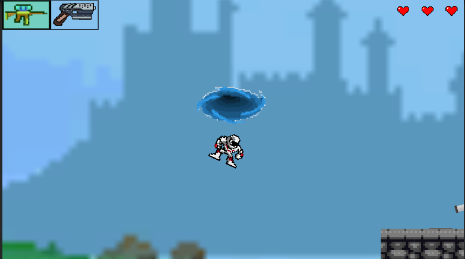
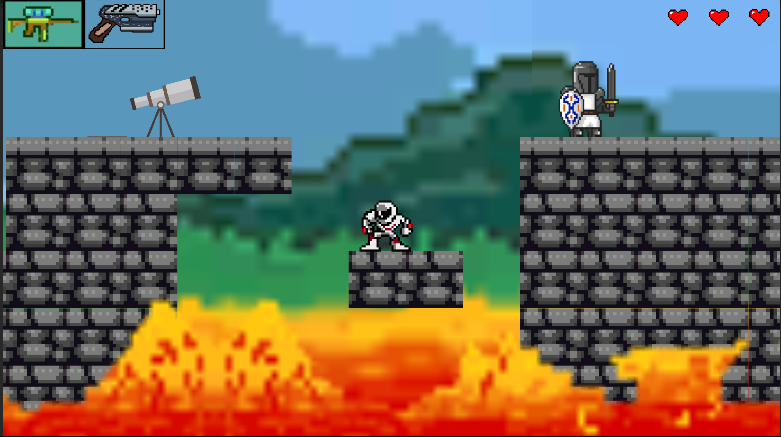

# GameJam2DPixelGame
# Projenin amacı: 3 gün içinde ortaçağda geçen yaratıcı bir oyun tasarlamak.
# Projeyi hazırlayanlar: Seher Kızıltaş, Sadullah Şener, Beril Öztürk

Aşağıdaki bağlantıda oyunun dosyası mevcuttur. 
[Drive Linki](https://drive.google.com/file/d/1MOZ3qksPNwYswUvNJ4f0vYDjbuax1Kl6/view?usp=drive_link) 

Bu proje piksel tasarımları içeren 2 boyutlu bir platform oyunudur. Oyunun ilk sahnesinde oyuncu yatağından kalkar ve giysi dolabına doğru ilerler. Daha sonra bir girdap içine çekilip kendisini ortaçağda bir kalede bulur. 
 

Oyuncu iki silaha sahiptir. 1. silahta 4 farklı renk ile farklı komutlar verilirken 2. silah ile bu komutlara bağlı olarak düşmana zarar verilir.
 

Oyuncu oyunu tamamladığında aslında her şeyin bir rüya olduğunu anlar.

Demo video:

https://user-images.githubusercontent.com/44115746/136672281-f89b7ebd-496c-45f9-9ba6-b8e6a4af6ffe.mp4
